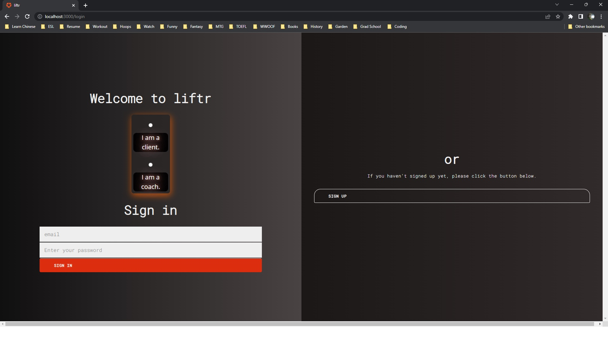
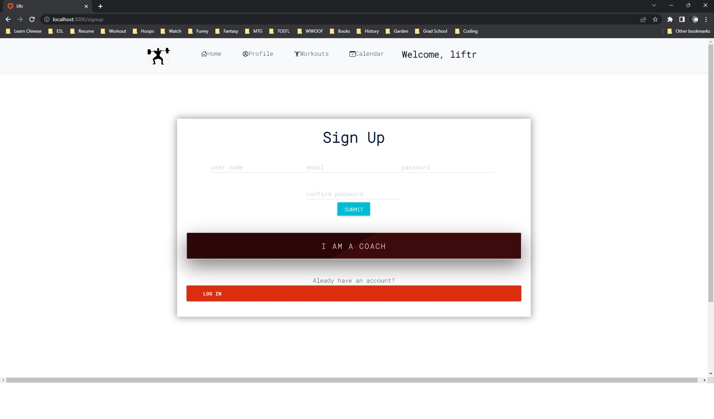
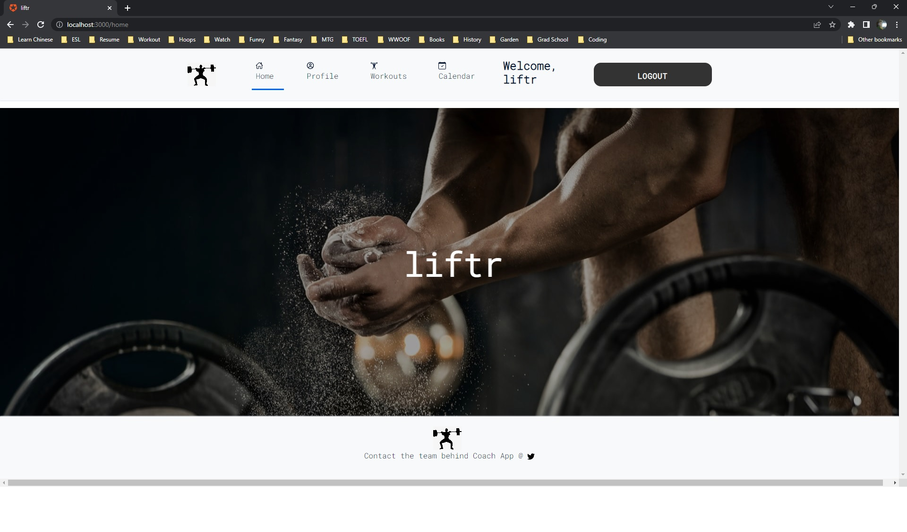
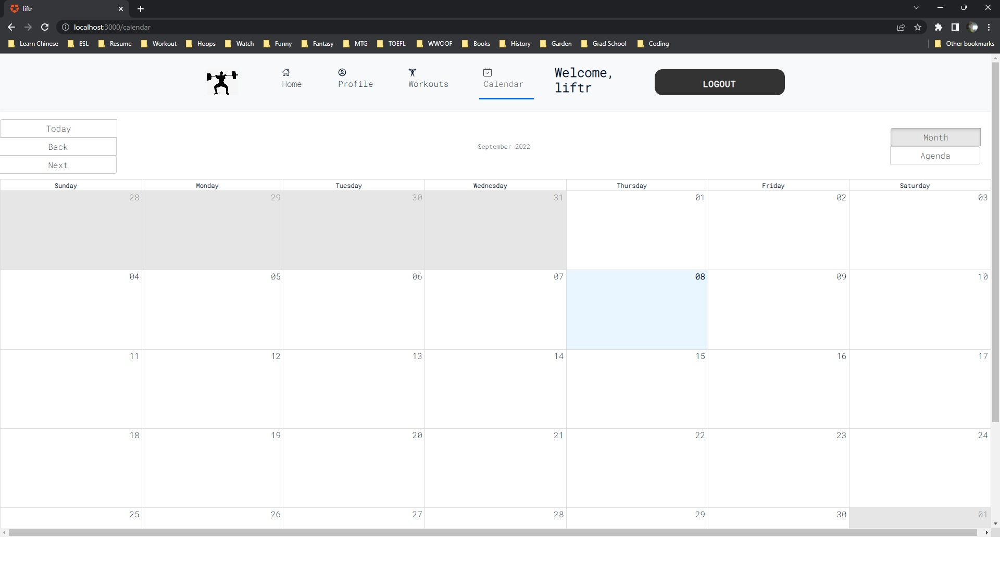
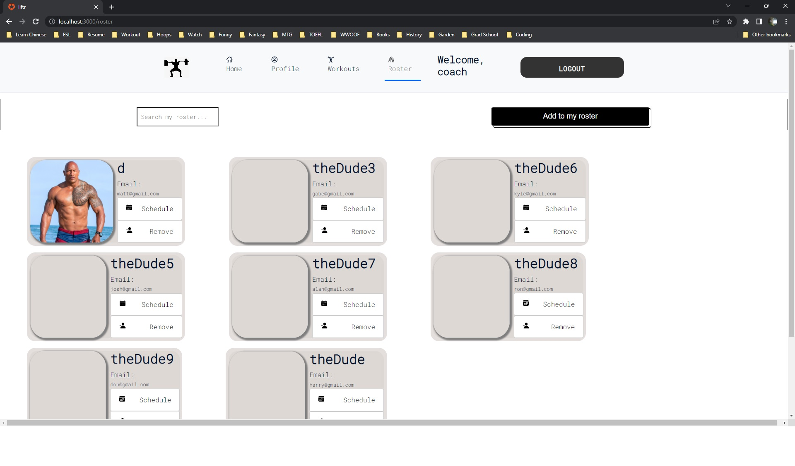

# liftr

## description

liftr is designed to make finding, scheduling, and following through on workouts with your coach easier- and things easier for the coach. With liftr, you can find your entire workout schedule- as assigned by your coach- all in one place. As a coach, you can easily navigate your trainees schedules and assign them detailed exercises set to be done on specific dates.

## table-of-contents

1. [user-story](#user-story)
2. [requirements](#requirements)
3. [composition](#composition)
4. [usage](#usage)
5. [reflections](#reflections)
6. [credits](#credits)
7. [contributors](#contributors)
8. [screenshots](#screenshots)

## user-story

# USER STORY FOR COACH

**AS A** lifting coach
**I WANT** an application to conveniently have access to all my coaching tasks
**SO THAT** I will not have to switch between multiple apps for a singular client

**WHEN** I log in
**THEN** I should be able to see my roster of clients
**WHEN** I click on a single client
**THEN** I should be able to get to the client's page
**WHEN** I am on the client's page
**THEN** I should be able to upload/update a new block (schedule) for the client, and leave feedback for client's uploaded videos

# USER STORY FOR CLIENT

**AS A** lifting client
**I WANT** an application to conveniently have access to my programming, and upload my videos for my coach
**SO THAT** I won't have to use multiple applications to check programs, send videos, and read my feedback.

**WHEN** I log in (w/ coach code)
**THEN** I should be able to see my profile
**WHEN** my coach uploads my block
**THEN** I should be able to see my block, along with all the excercises
**WHEN** I complete my excercises
**THEN** I should be able to upload details on all my sets with their weights onto the uploaded block (editable table)
**WHEN** I complete my primary days
**THEN** I should be able to upload a video of my sets onto their respective spots on the block for my coach to see and leave me feedback.

## composition

This app is composed of several packages and technologies:

-   [Sequelize](https://sequelize.org/)
-   [Cloudinary](https://cloudinary.com/)
-   [DotENV](https://www.npmjs.com/package/dotenv)
-   [Express](https://www.npmjs.com/package/express)
-   [MySQL2](https://www.npmjs.com/package/mysql2)
-   [Heroku](https://heroku.com/)
-   [Connect Session Sequelize](https://www.npmjs.com/package/connect-session-sequelize)
-   [Netlify](https://www.netlify.com/?utm_source=google&utm_medium=paid_search&utm_campaign=12755510784&adgroup=118788138897&utm_term=netlify&utm_content=aud-1291860397602:kwd-371509120223&creative=514583565825&device=c&matchtype=e&location=9033326)
-   [React](https://reactjs.org/)
-   [Axios](https://axios-http.com/docs/intro)
-   [bcrypt](https://www.npmjs.com/package/bcrypt)
-   [Express Session](https://www.npmjs.com/package/express-session)
-   [Express JWT](https://www.npmjs.com/package/express-jwt)
-   [Moment](https://momentjs.com/)
-   [React Icons](https://react-icons.github.io/react-icons/)
-   [Material UI](https://mui.com/)

Building liftr also involved the use of the app [Insomnia](https://insomnia.rest/), which is used outside of the users code editing software as a standalone application, in addition to [MySQLWorkbench](https://www.mysql.com/products/workbench/).

## usage

This web application is designed with both athletes and trainers alike in mind; thus, there are two different login routes that clients and coaches may log in via.

## reflections

-   The motivation for creating this project was continuing to develop our coding skills while utilizing a brand-new, complex and exciting tool in React. Some of the other key tools we used included:

    -   Node.js
    -   Sequelize
    -

    While we met our fair share of difficulties in building our application, we stayed motivated throughout to work through and comprehend code issues we were having. Said issues were including but not limited to:

    -
    -
    -
    -
    -
    -
    -
    -
    -
    -
    -

-   We built this project largely in order to...
-   This is a useful project in that it enables a user to...
-   This project represented an incredible jump in difficulty and learning curve that we were proud to tackle. We may not have overcome every hurdle we faced, but we overcame many. It was endlessly fascinating for us to learn, especially, how integrated front and back end are and the coordination they require between developers. We all feel infinitely more prepared for what is to come in our code adventures after this project.

## resources

List of resources utilized in this project:

-   [React Icons](https://react-icons.github.io/react-icons/)
-
-
-
-   [W3 Schools](https://www.w3schools.com/)
-
-
-

## contributors

Shout out to our hardworking team, which stayed on the grind to confront, fear, and eventually overcome multiple hurdles:

-   [Rainier Dutolong]()
-   [Matthew Hoefer]()
-   [Gabriel Sowa]()
-   [Josh Lee]()

And shout out to our friends, TAs, and tutors who lended a hand,

-   Pedro from PedroTech
-   Mathias Darr
-   Jacob Carver

## screenshots

-   
-   
-   
-   
-   
